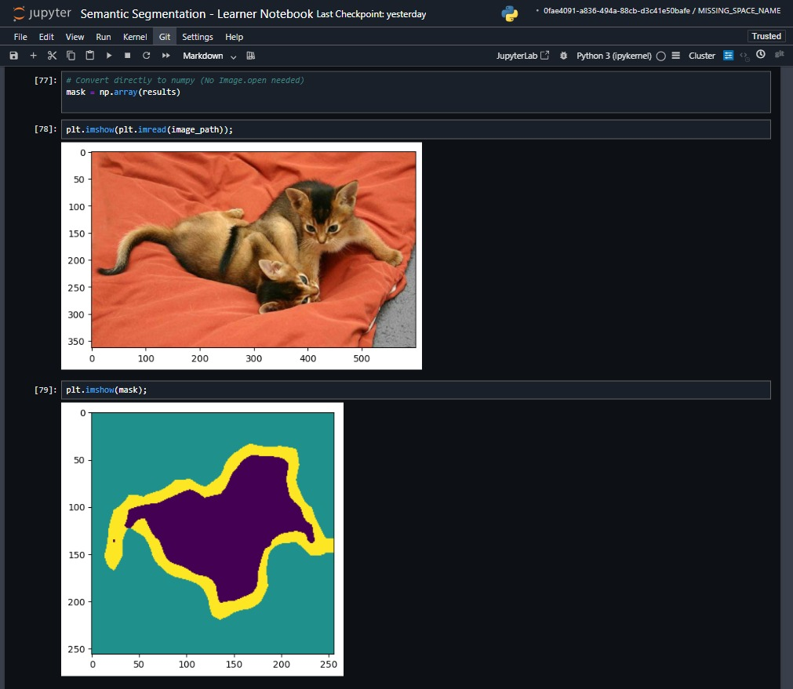

## Semantic Segmentation with Amazon SageMaker | Guided Project

### 1. Methodology
To overcome GPU unavailability, the standard ResNet pipeline was replaced with a **MobileNetV3-Large** architecture optimized for **CPU instances** (`ml.m5`). A custom training script (`train.py`) was implemented using PyTorch with `drop_last=True` to ensure stability with small batch sizes on CPU hardware.

### 2. Description
This project builds an end-to-end pipeline to perform semantic segmentation on the **IIIT-Oxford Pets Dataset**. It covers data preprocessing, training a custom lightweight model on Amazon SageMaker, and deploying a real-time inference endpoint to segment pets from backgrounds.

### 3. Input / Output
* **Input:** Raw RGB Image (JPG/PNG).
* **Output:** 4-Class Segmentation Mask (Values: 0=Background, 1=Foreground, 2=Pet, 3=Boundary).

### 4. Live link
* Deployed on **Amazon SageMaker Endpoint** (Deleted post-inference to minimize costs).

### 5. Results
Successfully segmented pet images with clear distinction between the animal (Class 2) and the background, verified via visual inspection of the prediction masks.

- The final trained model and processed data backup can be accessed here: [Open Link](https://drive.google.com/drive/u/0/folders/13teBlVBQjj6R_XFBl0FXj4yXdziI3jsA)
- **Platform Access:** This project was built and executed on the Amazon SageMaker platform: [https://console.aws.amazon.com/sagemaker/](https://console.aws.amazon.com/sagemaker/)

